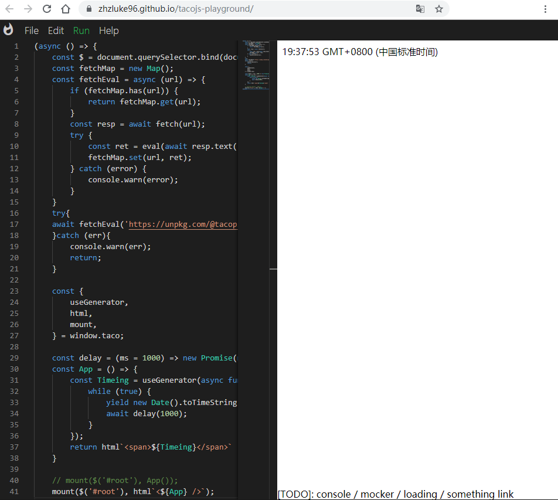

# Tacojs-playground

🌮Tacojs playground.

## Table of Contents

- [Tacojs-playground](#tacojs-playground)
  - [Table of Contents](#table-of-contents)
  - [Background](#background)
  - [Try it out](#try-it-out)
  - [Screenshot](#screenshot)
  - [Related Efforts](#related-efforts)
  - [Maintainers](#maintainers)
  - [License](#license)

## Background

Tool like codesandbox, but based [Tacojs](https://github.com/zhzLuke96/TacoJs).

## Try it out

Try the playground out on [github-pages](https://zhzluke96.github.io/tacojs-playground/).

## Screenshot

## Related Efforts

- [TacoJs](https://github.com/zhzLuke96/TacoJs)
- [monaco-editor](https://github.com/microsoft/monaco-editor)

## Maintainers

[@zhzluke96](https://github.com/zhzluke96).

## License

[MIT](LICENSE) © zhzluke96
